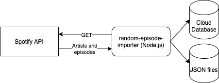

import { UnsplashAttribution } from '../../../src/components/UnsplashAttribution'

I really love audio dramas, espacially _Die drei ???_ ("Three Investigators").
And I'm not alone with that. The series has now been in production since 1979 and there are now over 200 episodes, Christmas specials,
merchandise, etc. Over fifty million records have been sold so far. So there are a lot of people out there who also like to listen to
them as much as I do (or even more).

In addition, of course, there are a variety of other series. _TKKG_, _Fünf Freunde_, _Point Whitmark_, just to name a few. 
But _Die drei ???_ is still my all time favorite. I found a good article on [Fluentu.com](https://www.fluentu.com/blog/german/german-dramas/) 
that will give you an overview of the topic if you're more interested.

Thanks to Spotify I have access to an almost endless number of audio dramas. Nevertheless, it is often difficult to find the an episode that 
fits my mood or situation. That's why I often ask my for a random episode ID. Unfortunately my wife is not a good randomizer. When I ask her 
for an episode ID, she answers "73!" most of the time 😉. But episode #73 of _Die drei ???_ is "Poltergeist" which is not a good episode if you 
want to listen to something relaxing while you try to fall asleep 👻 😱

So, there was only one way out: I had to build my personal random episode generator. I was aware that this one will sometimes make 
inappropriate suggestions to me, but I was hoping that the poltergeist would be suggested to me less often.

<UnsplashAttribution
  photographer={{ name: 'Clay Banks', url: 'https://unsplash.com/@claybanks' }}
/>

## Exploring possible solutions

To be honest, I started this project about two and a half years ago, kept discarding ideas and starting over again. 
I have gone down  many different paths to find a solution that fits my needs. First, I wanted to use Clojure for a
small backend application and React to implement the frontend.
I also made it to crawl wikipedia for episode titles and parse that information and fit it into a simple database schema.
But after a few days, I lost focus on this rather compliacted approach. There was a gap between the episode suggestion 
and the play button to start playback. Why should I use a suggestion application if I have to type this suggestion into Spotify 
by hand afterwards? Or even worse: If I would then have to search for the episode for a long time in a CD collection?

<UnsplashAttribution
  photographer={{ name: 'Javier Allegue Barros', url: 'https://unsplash.com/@soymeraki' }}
/>

Back in 2020 I stumbled over the idea of [Jamstack](https://jamstack.org/) applications ("JAM" means JavaScript, APIs and Markup). 
Jamstack promises better performance, higher security, cheap and easy scaling and a better developer experience. 
To explain the principle very briefly: You can use a static site generator like [Gatsby.js](https://www.gatsbyjs.com/)
to create static sites from Markdown, JSON, APIs, etc using React. Afterwards, you can deploy your static HTML, CSS and JavaScript
to a provider of your choice, e.g. GitHub pages or [Netlify](https://www.netlify.com/)! If you want to learn more about Jamstack 
there are a lot of resources about it out there!

Thinking about the Jamstack approach and my Spotify account I was approaching a new solution. Fortunately I found that
Spotify provides a comprehensive and well documentend [API](https://developer.spotify.com/). So I came up with the idea
of developing a web-based Jamstack application. It should get the information about the different episodes directly from
the Spotify API and provide a button that will play the episode on Spotify without redirection.

## Episode importer

But first things first. I had to access the Spotify API in order to fetch episode information and create a random 
playback button. So I created a Spotify developer account and generated an API key. With this key in hand I could use
ReST to get information about artists and albums. Artists of interest are stored in a small JSON object including their
name and Spotify artist id. Then I have create a small Node.js application that fetches all episodes of every artist
from the configuration object. Each sequence was then saved in JSON format. There ain't no magic in this. Just some
ReST calls, basic error handling and file I/O.

Later I added some more logic to the application. So now only the latest episodes are retrieved and the episode objects
are no longer persisted locally, but in a cloud database. 

You can see the source files of random-episode-importer on [GitHub](https://github.com/thr0n/random-episode-importer).

## Episode frontend

Once I finally had the episodes in JSON format as input (without scraping, woohoo!), it was time to set up Gatsby.js.
To get started, I just followed the [Gatsby tutorial](https://www.gatsbyjs.com/docs/tutorial/). In the tutorial you'll
will learn everything you need to know to create UI components, add styling, read JSON files as input, access the
imported JSON data using GraphQL, automatically create pages from data and much more.

I started with two GraphQL queries: A list of all artists and a list of all episodes grouped by the artist id. Based 
on this data I created an overview page that shows all artists that have been imported using the episode importer.
With a click on an artist, a random episode determined at the time of rendering is displayed. This works with the help
of a page generated specifically for the episode, to which the browser gets redirected. To play the episode on Spotify,
you just need to click on CD cover. Each click on an artist also defines a new random episode for the next run. 
This mechanism was implemented quite simply using `Math.random()` 🙈.

Recently, I added an additional page that shows the three latest releases for each artist. This is very handy if you
don't want to miss any new releases of your favorite artist!
But that's not the only feature that I've added. Additionally there is an Auth0 login form if you want to access
random episode. This was unfortunately necessary from my point of view, because I don't own the rights to the names
and cover images I display in the application 😔. All I can give you is my promise that it is a lot of
fun to work with the Spotify API (at least if you're a music lover) and build static websites with Gatsby and React.

Here's a small GIF recording of random episode to give you a hint of the look and feel of the application. On the first
screen, it shows the artist overview as well as a short info text of random episode's purpos. After that, you can
see how clicking on a tile redirects the browser to a random episode for the selected artist:

The source code of random-episode-frontend is also available on
[GitHub](https://github.com/thr0n/random-episode-frontend).

## Deployment

If you're looking for a way to host a static website, you'll probably come across Netlify fairly quickly.

- Deployment auf Netlify
- Trigger Build using Post 
- Import files from CloudDB
- Unprotected welcome page 

**// TODO** [random-episode-frontend](https://random-episode.netlify.app/) deployed on Netlify. 
For my eyes (and of course the eyes of my wife) only but it's fun to use and a good solution to prevent situations
I described in the introduction.

## Future improvements

- TypeScript im importer
- Firebase => Back4App?
- Scheduled build and deployment => new episodes every friday

**// TODO** Hope you're now angefixt! Thanks for reading!
