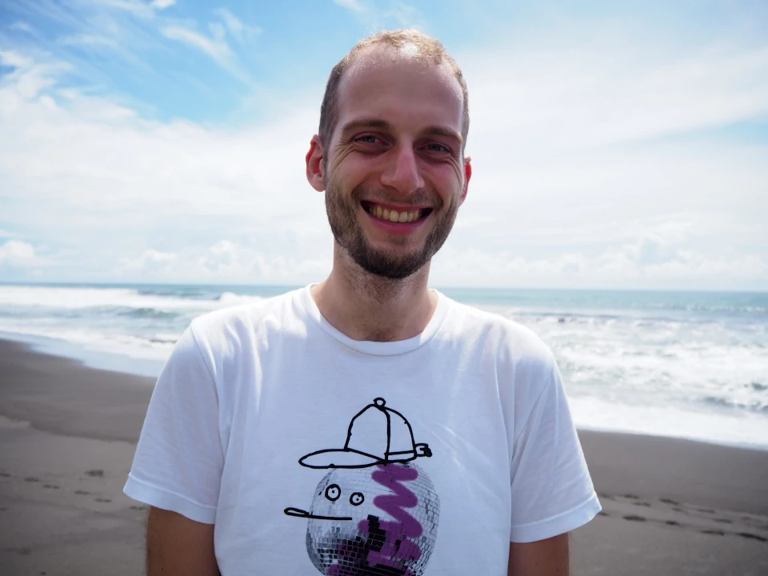

Hi there!

I'm Hendrik, Hamburg based software engineer passionate about full stack
development, software architecture, distributed systems, and web
technologies.

### Working experience

I have been working as a professional software developer for almost 4
years. I work mainly as a full stack developer with focus on frontend
technologies. In my recent projects I have mainly used Java, Kotlin,
Spring Boot, Vue, React and Terraform.

At the moment I like to play around with static site generators, Svelte
and Quarkus but Elm is also on my bucket list. Furthermore I'm interested
in internet of things and data science.

From time to time I write articles about programming stuff.

### Personal interests

I enjoy spending time with my wife Jessica and our two cats. Music plays
also a big role in my life. I collect vinyl, I like to go to concerts,
and I'm a (self-proclaimed) Spotify power user.

If you love German audio dramas (in German it's "Hörspiele") as much as
I do you definitely check out my random episode generator!
