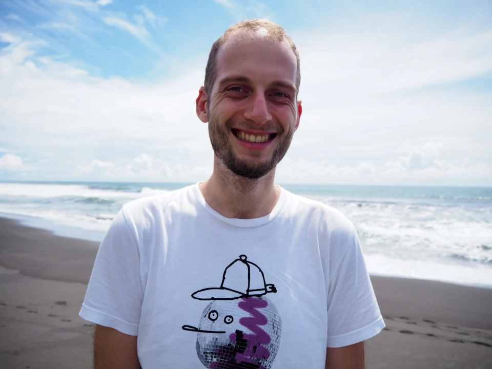

import WorkExperience from "../../../src/components/WorkExperience"
import { workExperience } from "../../../src/components/WorkExperience/data"

Hi there!

I'm Hendrik, a Hamburg-based full stack software engineer, with strong frontend experience and track record in software architecture.

### Working experience

I've been building production software since 2017 — mostly with Java, Kotlin, and Spring Boot on the backend, and React or Vue on the frontend. I enjoy working close to architectural decisions and have a soft spot for greenfield projects. 

Beyond the code, I care about the people writing it — I've had the chance to mentor developers and grow into a coaching role, and that's become as rewarding as the technical work itself.

<WorkExperience experiences={workExperience} />

Lately I've been exploring the agentic coding landscape — tools like Cursor and Claude Code, and what they actually change about how experienced developers work.

I occasionally write about software development [dev.to](https://dev.to/thr0n) or [medium.com](https://medium.com/@thr0n)

### Personal interests

I enjoy spending time with my wife Jessica and our son. Music plays also a big role in my life. I collect vinyl, I like to go to concerts, and I'm a (self-proclaimed) Spotify power user. Oh, and after a 20-year break I recently started playing handball again. Still figuring out if my joints agree.
