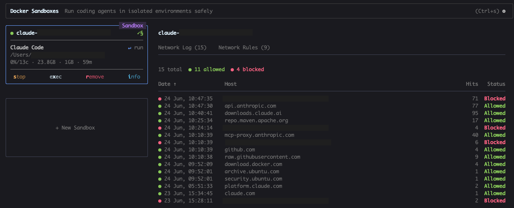

> This article was also published in [German](/claude-code-in-docker-sandboxes-de)!

Since generative AI took off, I've found it increasingly hard to find reliable information.
It used to be easier to judge whether a Stack Overflow thread or a tutorial would actually help me.
For most topics, I knew where to look.
Today, there are so many new sources out there and honestly, I struggle to assess the quality of most of them.
So I want to take a step back, work through the topic of "Claude Code, but safely", and share what I've learned along the way.

## Some context

Until recently, my exposure to agentic engineering was fairly limited: conversations with colleagues and friends, the occasional podcast episode, and LinkedIn posts that often felt shallow and hype-driven.

Then I attended a two-day workshop on agentic engineering at work.
We basically just typed `claude` into the terminal and let the agent do its thing.
The presenter talked a lot about "guardrails" but largely ran Claude Code in automode without really addressing what could go wrong.

And here's the thing: There's a real risk hiding in plain sight. `claude` runs with your full user permissions on the host system by default. Concretely, that means:

- **Full filesystem access:** everything your user can read, including `~/.ssh`, `~/.aws`, `.env` files, and so on
- **Unrestricted network access:** arbitrary URLs, downloads, outbound connections, credential exfiltration
- **Process execution:** shell commands, changing system settings, running package installers, creating cron jobs
- **Access to all shell environment variables**, including any API keys you've set

Imagine an AI agent accidentally running `rm -rf` in the wrong directory, modifying your Git configuration, or leaking an `.env` file. None of these actions are intentional, but they're possible if the agent has unrestricted access.

That's a steep price for automode, whose main benefit is avoiding the fatigue of confirming every single action.

Docker Sandboxes addresses this directly: the agent runs in a container with a defined network policy, an isolated filesystem, and no access to host secrets.
You don't have to judge every action on the fly because you set the boundaries upfront.

## Docker Sandboxes

A former colleague of mine (shoutout to Stefan!) posted on LinkedIn about using Docker Sandboxes and being impressed.
That was enough for me to dig in.

That brought me back to the original problem from the intro: which source do I trust?
I started with the official [Docker Sandboxes documentation](https://docs.docker.com/ai/sandboxes/), which is solid.
But for a first overview, I wanted something more digestible - ideally a video.
YouTube has no shortage of tutorials on this topic, so picking one wasn't easy.
I went with a video that had a decent number of views and good ratings.

<iframe width="560" height="315" src="https://www.youtube.com/embed/kNGXuIPXR24?si=K4F5-3_LAedCqEPV" title="YouTube video player" frameborder="0" allow="accelerometer; autoplay; clipboard-write; encrypted-media; gyroscope; picture-in-picture; web-share" referrerpolicy="strict-origin-when-cross-origin" allowfullscreen></iframe>

It turned out to be about 75% useful.
The creator walked through the concept, toured the documentation, and gave me a solid getting-started path.
The part about using a local model wasn't relevant to my setup, but everything else landed well.

## My setup

Installation was straightforward:

```bash
brew install docker/tap/sbx    # install the sbx CLI
sbx login                      # log in with your Docker account
sbx secret set -g anthropic    # store your Anthropic API key
```

On first login, you're prompted to choose a default network policy:

```
1. Open        - All connections allowed
2. Balanced    - Default deny, common dev domains allowed
3. Locked Down - Everything blocked unless explicitly allowed
```

I went with **Balanced**. It allows AI provider APIs, common package managers, and GitHub, while blocking everything else.

After that, starting your first sandbox is as simple as:

```bash
cd ~/my-project
sbx run claude
```

## The sbx dashboard

I'd recommend running the sbx dashboard in a separate terminal alongside your session:

```bash
sbx   # opens the interactive dashboard
```

From there you can see:
- Which sandboxes are currently running (navigate with arrow keys)
- `i` shows details: name, agent, status, mounted directories, resource usage
- A live log of all allowed and blocked network requests

The network tab in particular is unexpectedly useful.
You can watch in real time which connections Claude is making:



## A few hours later

Inside the sandbox, Claude requires an initial `/login`.
After that, Claude Code starts with `--dangerously-skip-permissions` by default. That's intentional: the sandbox itself is the security boundary. It doesn't protect against every possible risk, but it dramatically reduces the blast radius.

Repository analysis based on a prompt (essentially the content of my current user story) works just as expected, and generating code and test classes runs without issues.

The first obstacle came when the newly generated integration test couldn't be executed and the solution therefore couldn't be automatically verified.

```
The ~/.m2 directory doesn't exist — Maven hasn't been run yet in this environment,
so no local repository has been created.
```

The `~/.m2` directory simply doesn't exist in the sandbox. So there are no cached dependencies available.
On top of that, the network policy was blocking access to `repo.maven.apache.org`, so the Maven Wrapper couldn't bootstrap Maven either.

At this point I had two options: run the test myself (Claude gave me the exact `mvnw` command) or grant Claude the necessary access.
Since I'm comfortable with both `repo.maven.apache.org` and the local `~/.m2/repository`, I went with the latter.

**A note on `~/.m2/settings.xml`:** Claude suggested mounting the `settings.xml` alongside the repository directory. Since that file can contain credentials for private repositories, I mounted only `~/.m2/repository` so the `settings.xml` stays off-limits.

## New sandbox with the m2 mount

You can't add mounts to a running container after the fact, so I had to delete the existing sandbox and create a new one.

Before doing that, I asked Claude to summarize the session:

```
Summarize what we've done so far and what's next
```

Claude summarized the problem we'd analyzed, the findings, the code changes made, and - most importantly - the list of blockers with their causes and possible solutions. You can persist this context with `/memory`.

**Important:** the `/memory` context is stored inside the container by default, which means it's gone when the container is deleted. Before proceeding, make sure the context has actually been saved to your project directory or to `~/.claude/MEMORY.md` on the host. I got caught out by this and lost the context. Fortunately, not much had happened yet, so the damage was limited.

Deleting the old sandbox and creating a new one (including `~/.claude` as additional volume mount):

```bash
sbx rm <sandbox-name>

sbx create claude --name shop-dev \
  "$(pwd)" \              # project directory
  ~/.m2/repository:ro \   # Maven cache, read-only
  ~/.claude/              # Claude directory with write access
```

Then start it:

```bash
sbx run shop-dev
```

I reconstructed the lost context by asking Claude to look at the existing changes in the project and pick up from there.

## Allowing network access after the fact

Claude tried to run the integration test again but hit the same wall: the Maven Wrapper needed to download Maven, and the network was still blocked (clearly visible in the sbx dashboard).

This can be fixed from a separate terminal without restarting the sandbox:

```bash
sbx policy allow network --sandbox shop-dev repo.maven.apache.org
```

Back in Claude:

```
Try it again
```

Maven installs. Then Claude notices that our internal artifact registry is also unreachable. The failed request shows up in the dashboard. Since Claude has no credentials for the registry (and shouldn't), it solves the problem on its own: it creates a custom `settings.xml` that points to the mounted `~/.m2/repository` as a local `file://` repository.

After that, all tests pass.

## Wrap-up

The result on this branch is ready to review (or hand off to a review agent), push to GitHub, and open a pull request.

This setup does require some upfront configuration: directory mounts, network policies, one-time initialization. It can be simplified with a bash alias or wrapper script, but it's not entirely frictionless.

What cost me the most time, though, was a hallucination: Claude suggested a `settings.json` entry for automatic mounts that simply doesn't exist. That cost me a context I could have kept. A good reminder to always verify AI suggestions about your own toolchain configuration.

Overall, though, this experiment shows clearly what Docker Sandboxes delivers: by default, only your chosen working directory and a well-defined set of URLs are accessible. Everything else has to be explicitly unlocked.

Working inside the sandbox, I feel noticeably more relaxed running Claude Code. And at the same time, the restrictions make it very clear just how many requests and file operations Claude makes in automode without one. As a developer, it gives you a meaningful degree of control back over your own system and over resources within your organization. The configuration overhead is absolutely worth it. Running the dashboard alongside Claude Code has made the whole experience feel noticeably more controlled.

---

How do you assess this setup? Is there a better approach for mounting additional directories? Any general tips on agentic engineering and working with Claude Code? I look forward to your feedback!

> Disclaimer: I wrote this text, but it was translated with the help of AI.