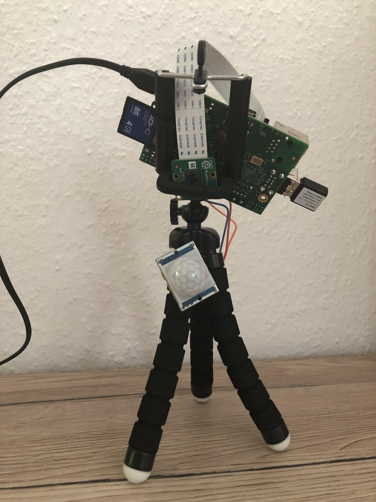

A few days ago, my neighbours discovered that someone had broken into their cellar. That was unpleasant news, both for them and for me. There are no treasures stored in my cellar, but the situation led me to the following question: What can I do if someone invades my home while I am away? 

From the perspective of a software developer, the answer is of course obvious. I just need a surveillance camera pointed at the front door that takes several photos when someone opens it. Of course, this does not prevent someone from coming in, but at least the person is photographed in the process 📸 And I know from German television that these can be quite helpful in tracking down the culprits 😉

### Hardware

In fact, you don't need much at all for a simple implementation of this idea. I use my old *Raspberry Pi Model B+* as a basis, which still contains an old *SD card* for the operating system. I also got the Pi *camera module* as a Christmas present years ago. Unfortunately, I seem to have lost my USB *Wifi adapter*. So I bought a new one, along with a simple *motion detector*.

So with this hardware I can now take photos when a movement is detected in the flat. But what if the SD card runs out of space or a possible burglar takes it? 



### Cloud storage

This problem can be solved using a cloud storage. It's enough to just store the images on the Pi temporarily and then upload them to the cloud. This also has the advantage that I can check from anywhere and at any time whether anything has happened in the flat. Since I have had a Dropbox account for years, I use it for backing up the photos. With this account, it is very easy to create an app on the [developer page](https://www.dropbox.com/developers). What you need at the end is an access token with which the app can access Dropbox.

### Software

To my surprise, I only needed a some libraries and a few lines of Python code for a simple camera functionality.

Most of the work is done in the `pressed()` method. First, five photos are created and saved under a temporary name on the SD card. The Dropbox app is then accessed using the access token. The photos can then be uploaded with the db object. The rest of the code is initialisation and deleting temporary files that are still in the directory after a possible crash. The number of photos to be taken or the waiting time after the sensor has triggered can of course be individually adjusted.

```python
#!/usr/bin/python3
from dotenv import dotenv_values
from gpiozero import Button, LED
from time import sleep
import datetime, dropbox, picamera, os

config = dotenv_values(".env")
db_ac = config["DB_ACCESS_TOKEN"]
num_pics = 5
button = Button(7, pull_up=False)

def pressed():
    camera = picamera.PiCamera()
    camera.vflip = True
    camera.hflip = True
    camera.resolution=(2592, 1944)
    for x in range(num_pics):
        localname = 'tmp' + str(x) + '.jpg'
        camera.capture(localname)
    camera.close()

    db = dropbox.Dropbox(db_ac)
    for x in range(num_pics):
        localname = 'tmp' + str(x) + '.jpg'
        f = open(localname, 'rb')
        timestamp = datetime.datetime.now().isoformat()
        upname = '/rapi-' + timestamp + '.jpg'
        db.files_upload(f.read(), upname)
        f.close()
        db.close()
        os.remove(localname)

for x in range(num_pics):
    if os.path.exists("tmp" + str(x) + ".jpg"):
        os.remove("tmp" + str(x) + ".jpg")

while True:
    button.wait_for_press()
    pressed()
    sleep(5)
```

### Conclusion
In the end, I could not find any intruders in the pictures. The only thing that stood out was my cat Frieda, who was obviously trying to catch a fly. What luck! I very much hope that it stays that way.

