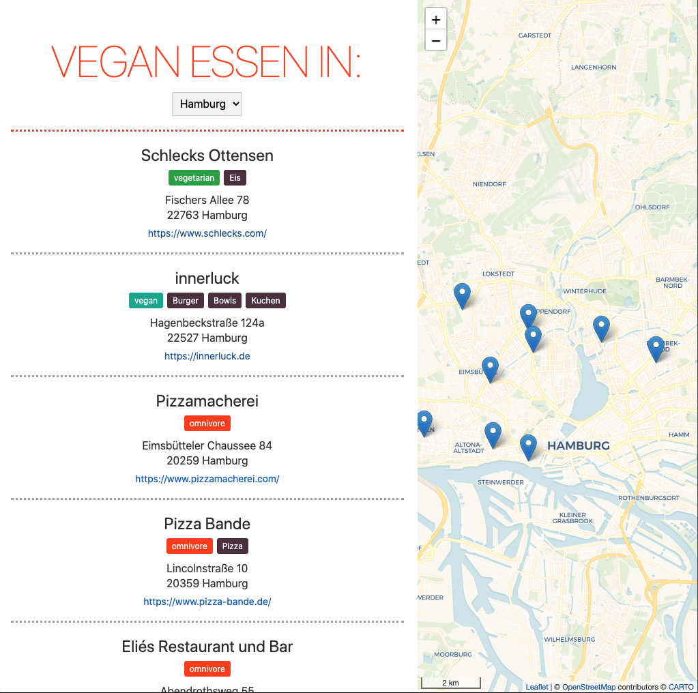
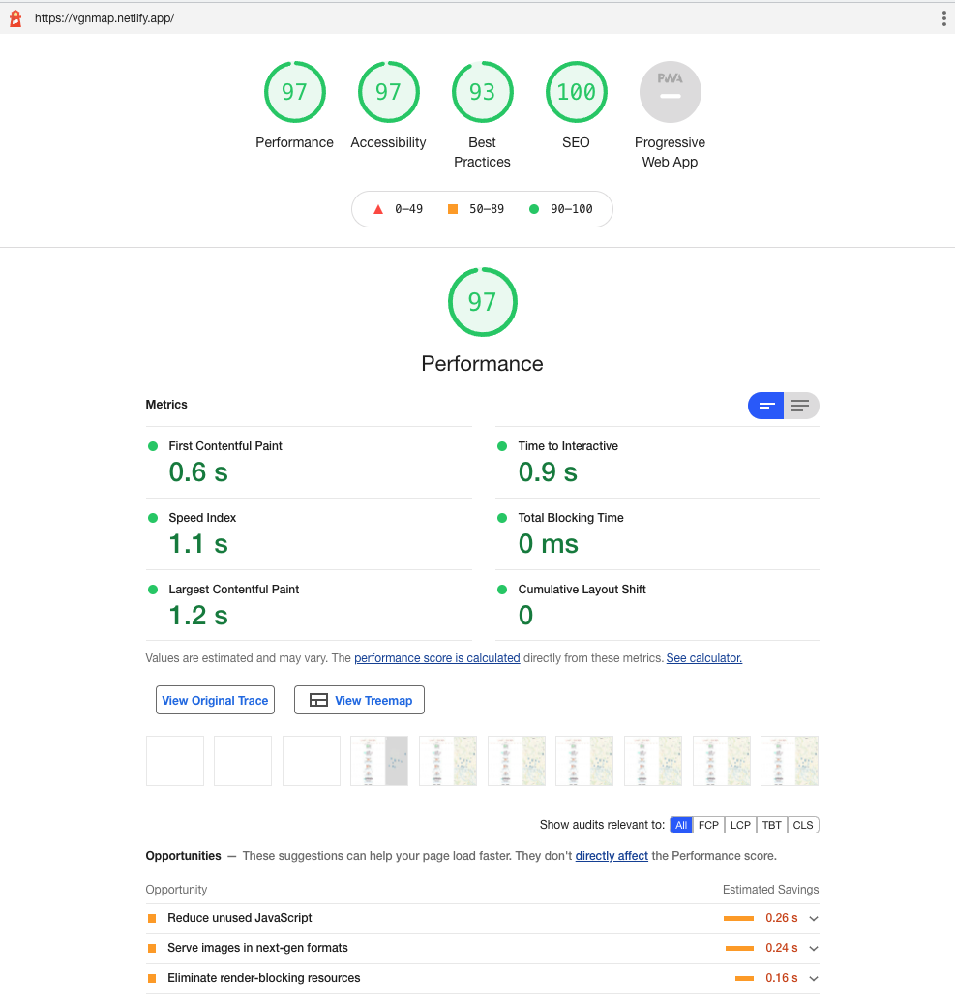

Trying out [Svelte](https://svelte.dev/) was on my bucket list for months or maybe even for years.
Especially after hearing this [talk](https://www.youtube.com/watch?v=AdNJ3fydeao) by Rich Harris.

When I was thinking about vegan restaurants in my hometown I finally found a suitable use case:
I wanted to show my favourite vegan food locations on a map.
That way I can remember where I've been and which restaurants I still want to go to. 
I also wanted to display information such as the address or excerpts from the menu in a list 🍔🍕🍣 🌱.
In addition, the list should focus on the selected restaurant on the map when clicked.

## Implementation

To store and provide the data about the restaurants, I use the content management system *Contentful*. 
In my current client project, I already work with another CMS, but I find Contentful very suitable for managing the restaurants.
In particular, the Google Maps function integrated into Contentful was very helpful.
With it, I can search for a restaurant and save the coordinates determined by Google Maps in the CMS.
With a simple `GET` request, I can then retrieve the coordinates together with other restaurant data like address, website, etc. and show them in the frontend 🗺.

I created the Svelte project with `degit` according to these [instructions](https://svelte.dev/blog/svelte-for-new-developers).
In addition, I use TypeScript and [SCSS](https://linguinecode.com/post/add-sass-svelte-js), which can be configured subsequently with little effort.
The application itself consists mainly of a `GET` request to Contenful to read the restaurant data.
I use Leaflet to display the map. 
Now when I publish new restaurants in Contenful, they are visible in the frontend after a few seconds. 
Oh, and have you already discovered the very simple dark mode? 🌚

The application was [deployed](https://vgnmap.netlify.app/) on Netlify.
A push on the main branch in Github starts the build process on Netlify, where the latest version of the project is then delivered:



## Svelte Highlights

In preparation for the development of the application, I only spent a few hours reading the very good Svelte [tutorial](https://svelte.dev/tutorial/basics).
So I would not be surprised if the code is not optimal in some places.
However, I did recognise a few highlights from Svelte, especially compared to React or Vue.js.

### Reactive declarations

I really like the idea of reactive declarations.
The label of the theme button depends on which theme is currently selected. 
`themeLabel` will be recomputed when `theme` changes and Svelte will afterwards update the DOM.
To mark a variable as reactive, the `$:` symbol is used.

```js
$: themeLabel = theme === "light" ? "Lights off" : "Lights on";
```

### Reactive lists

Reactivity works also on lists!
If I select a different city in the checkbox, the list of restaurants to be displayed is refreshed.

```js
$: restaurantsToShow = restaurants
  .filter((r) => r.address.city === selectedCity)
  .sort((a, b) =>
    a.position[1] > b.position[1] ? 1 : a.position[1] < b.position[1] ? -1 : 0
  );
```

### Conditional classes

Conditional classes can also be used very easily.
The div below only gets the class `"restaurant-section-dark"` assigned if `theme` is equal to `"dark"`.

```js
<div
  class="restaurant-section"
  class:restaurant-section-dark={theme === "dark"}>
</div>
```

### Performance

The Lighthouse Score of the application is very good without me having done anything special for it (at least in the desktop view). 
Svelte says about itself:

> Svelte compiles your code to tiny, framework-less vanilla JS — your app starts fast and stays fast

Check out the [article](https://svelte.dev/blog/virtual-dom-is-pure-overhead) about the Virtual DOM and why Svelte doesn't use one!

The Lighthouse Report seems to confirm this:



There is still room for improvement in the mobile view.
In particular, the dependencies on Leaflet and the loading of the map tiles are noticeable. 
I'll deal with that another time, all right?
But that leads us directly to the section with the improvements I can make in the future!

## Future improvements

I have just mentioned it, but I like to say it again.
In the future, I would like to improve the performance on mobile devices.
If you have any tips for improvement (especially for Leaflet), I'd definitely appreciate a message from you!

I would also like to add and display more information about the restaurants.
For example, I am thinking of photos, ratings and opening hours.
So far, there are also only a few restaurants in Hamburg, Berlin and Munich.
But other cities will surely follow.
At the latest when I add restaurants from other countries, I will also have to do some internationalisation.

And I quickly finished the project in my spare time between Christmas and New Year 🙈
The code base should therefore still be tidied up and the city coordinates need to be removed from the code.
But before I start, I should definitely write a few tests...

